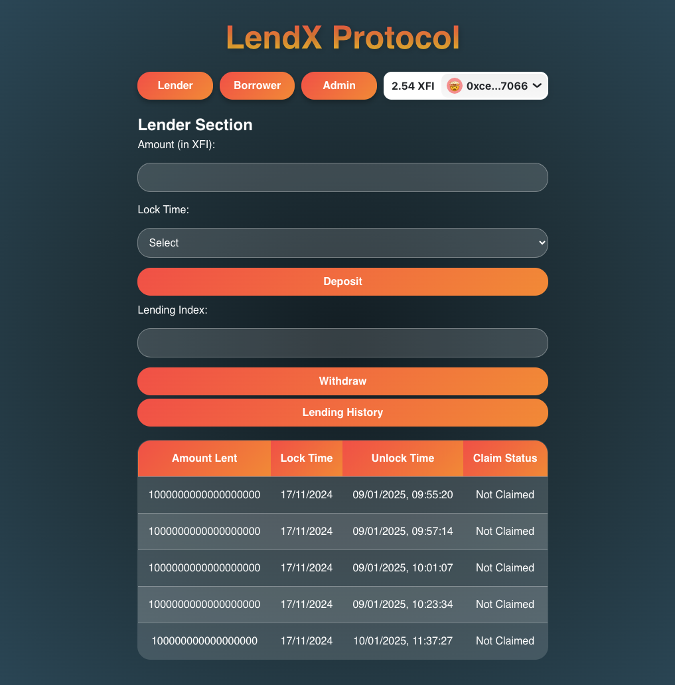

# LendX Protocol

## Project Front Page

Here is a preview of the project's front page:

## Overview

The **LendX Protocol** contract is a decentralized lending and borrowing system that allows borrowers to request loans without collateral, while lenders provide funds and earn rewards based on their deposits. The system features loan repayment, late fees, insurance, and mechanisms to manage defaulters, including blacklisting.

## Key Features

- **Lender Deposits**: Lenders can deposit funds for a fixed lock period (30, 90, or 180 days) and earn interest on their deposit.
- **Borrower Loans**: Borrowers can request loans without collateral but must repay them with interest and possibly a late fee.
- **Late Fees**: If a borrower repays after the due date, a late fee is accrued based on the overdue period.
- **Insurance Pool**: A 2% insurance fee is deducted from each loan to create a pool for defaulted loans.
- **Blacklisting**: Borrowers who default on loans are blacklisted from borrowing again.
- **Owner Management**: The owner has control over blocking and unblocking borrowers, as well as managing the insurance pool.

## Getting Started

### Prerequisites

- Basic understanding of Ethereum smart contracts and Solidity.
- MetaMask or any Ethereum-compatible wallet for interacting with the contract.

### Installation

1. Clone this repository to your local machine.
2. Compile and deploy the contract using Remix IDE or any other Solidity development environment.
3. Ensure your wallet is connected to the network where the contract is deployed.

### Deployment

Deploy the contract with the desired parameters. After deployment, users can interact with the contract for lending and borrowing functions.

## Contract Functions

### Lender Functions

- **deposit(uint256 _lockTime)**: Lender deposits funds into the contract with a specified lock period (30, 90, or 180 days).
- **withdraw(uint256 lendingIndex)**: Lender can withdraw funds along with rewards once the lock period has ended.

### Borrower Functions

- **borrow(uint256 _amount, uint256 _loanPeriod)**: Borrower requests a loan, specifying the loan amount and duration (30, 90, or 180 days).
- **repayLoan(uint256 loanIndex)**: Borrower repays the loan with interest and late fees, if applicable.

### Owner Functions

- **recoverDefaultedFunds(address _borrower)**: The owner can recover funds from defaulted loans using the insurance pool.
- **unblacklistBorrower(address _borrower)**: The owner can remove a borrower from the blacklist.
- **setBaseInterestRate(uint256 rate)**: The owner can set the base interest rate for loans.
- **setLateFeeRate(uint256 rate)**: The owner can set the late fee rate for overdue loans.

### Utility Functions

- **calculateRepaymentAmount(address _borrower, uint256 loanIndex)**: Calculates the total repayment amount, including interest and late fees, for a specific loan.
- **getLoanHistory(address borrower)**: Retrieves the loan history for a borrower.
- **getLendingHistory(address lender)**: Retrieves the lending history for a lender.

## Events

- **LoanRepaid(address indexed borrower, uint256 amount)**: Triggered when a borrower repays a loan.
- **DefaultRecovered(address indexed borrower, uint256 recoveredAmount)**: Triggered when defaulted funds are recovered.

## Contract Variables

- `baseInterestRate`: The interest rate applied to loans (default 5%).
- `lateFeeRate`: The rate at which late fees are applied (default 2% per month).
- `insurancePool`: A pool of funds used to cover defaulted loans.

## Future Development

- **Customizable Loan Periods**: Support for flexible loan durations.
- **Interest Rate Adjustments**: Enabling dynamic interest rates based on market conditions.
- **Cross-Chain Lending**: Expansion to other blockchain networks for decentralized lending and borrowing.

## Contributing

Contributions are welcome! To contribute, fork this repository, make your changes, and submit a pull request.

## License

This project is licensed under the MIT License. See the LICENSE file for details.

## Support

For any inquiries or support, please open an issue on the GitHub repository or contact us via email.

## Links

- **GitHub Repository**: [https://github.com/Anish99594/LendingWithoutCollateral](https://github.com/Anish99594/LendX.git)
- **Demo Video**: [Watch here](#)
- **Project Website**: [https://lend-x-anish99594s-projects.vercel.app/](https://lend-x-anish99594s-projects.vercel.app/)
